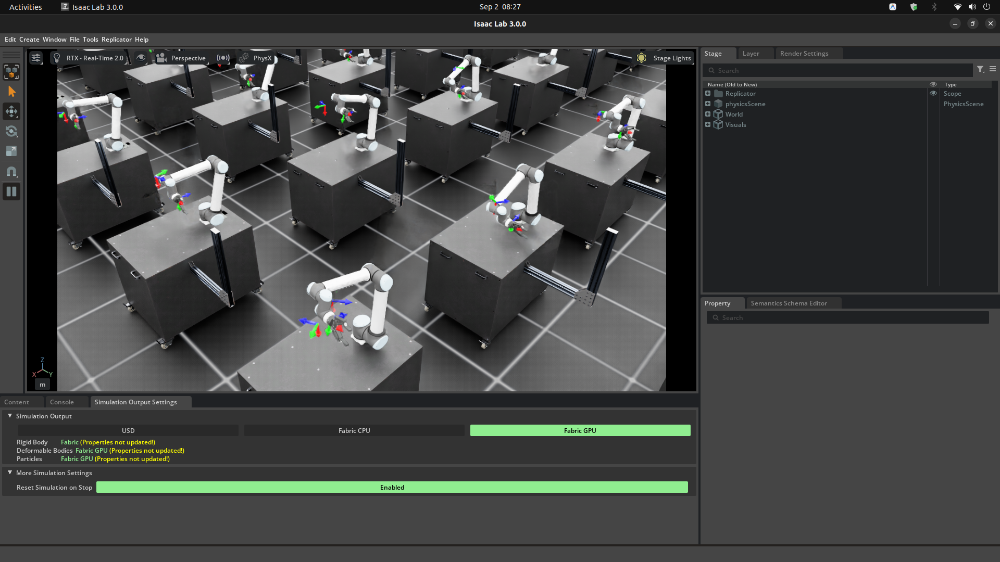

# Isaac Lab UR10 Reach: Goal Pose Tracking with PPO & Manager-Based RL

## Overview

This repository contains a manager-based reinforcement learning environment for a **Universal Robots UR10** robotic arm equipped with a gripper. The robot is mounted on a workstation table (`SeattleLabTable`).  This repository was created following the [Train Your Second Robot in Isaac Lab](https://docs.nvidia.com/learning/physical-ai/getting-started-with-isaac-lab/latest/train-your-second-robot-with-isaac-lab/index.html) module from [Getting Started With Isaac Lab](https://docs.nvidia.com/learning/physical-ai/getting-started-with-isaac-lab/latest/index.html)

### Screenshot


### Policy Goal

The goal of the policy is **end-effector 6D pose tracking** (reach task):
- **Task**: Control the joint positions of the UR10 arm (`shoulder_.*`, `elbow_.*`, `wrist_1.*`) to accurately move the end-effector (`ee_link`) to a commanded 6D target pose `(x, y, z, roll, pitch, yaw)` in 3D space.
- **Observations**: Joint positions (relative), joint velocities (relative), target pose command, and previous actions.
- **Actions**: Joint position targets for the robot arm.
- **Rewards**: End-effector position tracking error (coarse L2 + fine-grained tanh reward), orientation tracking error, action rate penalty, and joint velocity penalty.

---

## Installation

1. **Install Isaac Lab**: Follow the official [Isaac Lab Installation Guide](https://isaac-sim.github.io/IsaacLab/main/source/setup/installation/index.html).

2. **Install Extension Package**: Using the Python interpreter from Isaac Lab, install this package in editable mode:

   ```bash
   uv run --project ~/git/IsaacLab pip install -e source/Reach
   ```

---

## Command Usage

### List Registered Environments

Verify the environment installation and list available tasks:

```bash
uv run --project ~/git/IsaacLab scripts/list_envs.py
```

Registered environment IDs:
- `Template-Reach-v0`: Main RL training environment (2000 parallel environments).
- `Template-Reach-Play-v0`: Evaluation environment for testing trained policies (50 parallel environments, noise disabled).

---

### Training a Policy

Train a PPO policy using SKRL:

```bash
uv run --project ~/git/IsaacLab scripts/skrl/train.py --task=Template-Reach-v0
```

To run training headless (without rendering GUI):

```bash
uv run --project ~/git/IsaacLab scripts/skrl/train.py --task=Template-Reach-v0 --headless
```

---

### Playing / Evaluating a Policy

Run and visualize a trained policy checkpoint:

```bash
uv run --project ~/git/IsaacLab scripts/skrl/play.py --task=Template-Reach-Play-v0
```

---

### Running Dummy Agents

Test environment execution and step integrity using baseline agents:

- **Zero-Action Agent**:
  ```bash
  uv run --project ~/git/IsaacLab scripts/zero_agent.py --task=Template-Reach-v0
  ```

- **Random-Action Agent**:
  ```bash
  uv run --project ~/git/IsaacLab scripts/random_agent.py --task=Template-Reach-v0
  ```

---

## Code Formatting

Run repository pre-commit checks and code formatting:

- **Using standard Isaac Lab wrapper**:
  ```bash
  ./isaaclab.sh -f
  ```
- **Using `uv`**:
  ```bash
  # Option 1: Via the Isaac Lab wrapper with uv run
  uv run ./isaaclab.sh -f
  # Option 2: Directly via pre-commit using uv run
  uv run pre-commit run --all-files
  # Option 3: Ephemeral run with uvx (no installation required)
  uvx pre-commit run --all-files
  ```

